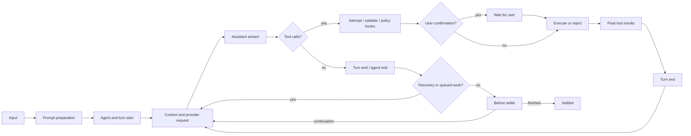
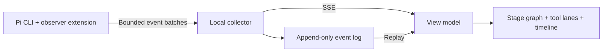

# Pi execution visualization research

Research date: 2026-09-25. Scope: Pi CLI extension development, execution instrumentation, GitHub evidence, and integration choices for Kite. No production extension, UI, or upstream modification was implemented.

## Findings

Pi exposes enough supported events to visualize its main agent loop without modifying its core. The released CLI has **39 named extension events**; the inspected development commit has **40**. An extension can observe input, context construction, provider request boundaries, streamed text/thinking/tool arguments, tool attempts and results, user prompts, session changes, compaction, and final settlement.

However, it does not expose every internal operation. Extensions and SDK/RPC subscribers receive different event sets. Precise agent retry scheduling and queue contents are SDK/RPC events. Child sessions, arbitrary extension internals, provider implementation details, and model-internal reasoning require separate instrumentation or cannot be observed. “Highly customizable” does not imply a universal tracing API.

For an existing terminal workflow, use a passive extension and a local collector. If Kite launches and controls Pi, use **RPC plus that extension** to cover more stages. The same event model can serve both modes; do not implement both launch modes before the product choice is made.

## Versions and local references

| Reference | Revision | Evidence |
|---|---|---|
| Installed CLI | `@earendil-works/pi-coding-agent@0.87.1` | Installed package metadata, declarations, and live probe |
| Released upstream | `v0.87.1`, `f07218c4d4bbc12bef056a7058c3dd49dfe41abe` | Git tag; release published 2026-09-22 |
| `reference/pi` | `b2bd111f2d46eed1a4689c32f30fde6306498827` | Shallow clone of upstream `main`; release tag also fetched |
| `reference/pi-agent-observability` | `cbb8cc30b9bb2ff1b93a20d4415f72877b019868` | Community source reviewed, not executed |
| `reference/pi-telemetry` | `fb9c67b81e537cd3768e203375c352fd9be42218` | Community source reviewed, not executed |

The upstream repository is [earendil-works/pi](https://github.com/earendil-works/pi). GitHub resolves the old `badlogic/pi-mono` location to it. Older examples can also use outdated package names and event names.

**Version trap:** `main` still declares package version 0.87.1, but its `provider_stream_event` hook is under **Unreleased**. It was merged in [PR #9901](https://github.com/earendil-works/pi/pull/9901) on 2026-09-23, after the latest release. The installed CLI has no corresponding declaration and emitted no such event in the probe. Treat this capability as development-only until a published version includes it. All other events in the inventory below are present in the release declaration.

The reference clones are local, ignored by Kite Git, and unmodified. Recreate them with `git clone --depth 1 <repository-url> reference/<name>`; fetch the listed commit/tag when reproducing this snapshot. Source links below pin immutable revisions.

## What “plugin” means here

The supported CLI customization mechanism is an **extension**: a TypeScript or JavaScript module exporting a factory that receives `ExtensionAPI`. A **Pi package** distributes extensions, skills, prompt templates, and themes. A **skill** is model-facing instructions, not an executable lifecycle subscriber.

There is also `src/experimental/plugin.ts`, an experimental facet/service architecture, and a telemetry package in the monorepo. The architecture document explicitly calls itself a design specification; the telemetry design explicitly says that much span coverage and cross-process propagation remains unfinished. These are not evidence that the installed CLI already supports a complete distributed trace feed. Build against the supported extension/RPC contracts for the current product. [S1, S9, S10]

### Development workflow

1. Export `default function (pi: ExtensionAPI) { ... }`; register explicit `pi.on("event_name", handler)` handlers. There is no documented wildcard subscription for all lifecycle events.
2. During development, load with `pi --extension ./extension.ts`. Pi uses `jiti`, so a separate TypeScript build is not required for a local extension.
3. Discover personal extensions under `~/.pi/agent/extensions/`, project extensions under `.pi/extensions/`, or explicit configured paths. Project resources follow Pi's trust rules. A global/CLI extension can observe `project_trust`; project extensions load too late to decide their own trust.
4. Register capabilities in the factory. Start persistent sockets, timers, or watchers in `session_start`; clean them up idempotently in `session_shutdown`. Reload and session replacement retire old contexts. Do not retain a previous context after replacement.
5. For distribution, add `"pi": { "extensions": ["./src/extension.ts"] }` to `package.json`, optionally with the `pi-package` keyword. Use the current `@earendil-works/*` imports and host-provided packages as peers. Recheck the installed-version packaging documentation; main also contains unreleased dependency-installation fixes.
6. Keep event capture independent of terminal rendering. Extensions load in TUI, RPC, JSON, and print modes. Guard terminal components with `ctx.mode === "tui"`; `ctx.hasUI` is also true for supported RPC interactions.

A minimal TUI observation example, not the external collector implementation:

```typescript
import type { ExtensionAPI } from "@earendil-works/pi-coding-agent";

export default function (pi: ExtensionAPI) {
  pi.on("agent_start", (_event, ctx) => {
    if (ctx.mode === "tui") ctx.ui.setStatus("kite", "Running");
  });
  pi.on("ui_prompt_start", (_event, ctx) => {
    if (ctx.mode === "tui") ctx.ui.setStatus("kite", "Waiting for input");
  });
  pi.on("agent_settled", (_event, ctx) => {
    if (ctx.mode === "tui") ctx.ui.setStatus("kite", "Settled");
  });
}
```

Beyond observation, extensions can register/override tools and providers, add commands/shortcuts/flags, transform input and model context, inject messages, control active tools/model/thinking level, append session entries, and customize terminal components. `pi.events` is a separate in-process extension event bus, not a mirror of every core event and not a cross-process transport. [S1, S2, S8]

## Complete extension event inventory

The table enumerates all 39 released event names and the one additional development event. “Observe” means a return value is not a supported transformation for that event. Even observational callbacks run inside Pi and must not mutate shared values.

| Stage | Event(s) | Available information | Supported influence / visualization use |
|---|---|---|---|
| Project trust | `project_trust` | Working directory, limited trust UI context | Decide yes/no/undecided and optional remembering; not a normal session context |
| Additional resources | `resources_discover` | CWD, startup/reload reason | Add skill/prompt/theme paths; fires **after** `session_start`, not once per file load |
| Session opened | `session_start` | Reason: startup/reload/new/resume/fork; previous file where applicable | Start collector, snapshot session/branch/model/tool state |
| Session metadata | `session_info_changed` | Session name | Update session title |
| Session replacement | `session_before_switch` | New/resume reason, target file | Cancel replacement; later `session_start` identifies the new session |
| Session fork | `session_before_fork` | Entry ID, before/at position | Cancel or alter restore behavior; later `session_start(reason=fork)` |
| Tree navigation | `session_before_tree`, `session_tree` | Target/common ancestor, entries to summarize; old/new leaf, optional summary | Cancel/customize summary before navigation; observe resulting branch |
| Compaction preparation | `session_before_compact` | Preparation, branch entries, signal, manual/threshold/overflow reason, willRetry | Cancel or supply custom compaction |
| Compaction outcome | `session_compact`, `session_compact_failed` | Compaction entry or error/aborted flag, reason, willRetry, fromExtension | Distinguish successful reduction, cancellation, failure, overflow recovery |
| Runtime disposal | `session_shutdown` | Quit/reload/new/resume/fork reason and possible destination | Flush/close resources; not guaranteed after a crash or forced kill |
| Prompt ingestion | `input` | Text/images, interactive/rpc/extension source, steering/follow-up intent | Continue, transform, or handle input; not a universal slash-command notification |
| User shell escape | `user_bash` | Command, CWD, exclusion from model context (`!!`) | Replace operations/result; distinct from a model's bash tool call |
| Prompt preparation | `before_agent_start` | Expanded prompt/images, rendered system prompt, structured prompt options | Add message or change system prompt/options |
| Low-level run | `agent_start`, `agent_end` | End includes generated messages | Observe one agent loop; end is not overall completion |
| Turn boundary | `turn_start`, `turn_end` | Start index/time; end assistant, tool results, persisted entry IDs and boundary preview | End can propose entries and request continuation; one turn is assistant plus its tool batch |
| Message lifetime | `message_start`, `message_end` | Message and role; completed content/usage/stop reason | End can replace the finalized message while preserving role |
| Assistant stream | `message_update` | Cumulative message plus normalized content-block event | Highlight text, exposed thinking, or streamed tool arguments |
| Conversation context | `context` | Non-system conversation messages | Return changed messages; Pi restores its prompt/tool state |
| Full request context | `context_with_system` | Full transcript after `context`, including system messages | Transform whole transcript; preserve leading system message |
| Provider payload | `before_provider_request` | Provider-specific payload | Replace payload; observe construction, not proof bytes reached server |
| Provider headers | `before_provider_headers` | Mutable assembled request headers | Inject/delete headers; never export credentials by default |
| Provider response | `after_provider_response` | HTTP status and headers before body consumption | Observe response boundary; do not assume every failed HTTP attempt reaches it |
| Raw provider stream | `provider_stream_event` **Unreleased** | Provider/API/model and parsed provider event | Observe before normalization; not raw network bytes; custom providers must opt into callback |
| Cache refresh decision | `cache_warming_decision` | Warm/miss cost, continuation probability, action | Override warm/stop; this is a decision, not a complete refresh span |
| Tool attempt | `tool_execution_start` | Call ID/name/raw arguments | Attempt begins before validation and hooks; execution body might never run |
| Tool policy hook | `tool_call` | Call ID/name/validated input | Mutate input or block; later handlers can be skipped after a block |
| Tool progress | `tool_execution_update` | Call ID/name/arguments/partial result | Progress exists only when tool implementation calls `onUpdate` |
| Tool result hook | `tool_result` | Call ID/input/content/details/isError/usage | Transform result; skipped for calls rejected before execution |
| Tool attempt ends | `tool_execution_end` | Call ID/name/final result/isError | Terminal outcome of attempt, including blocked/invalid calls |
| Model selection | `model_select` | Current/previous model, set/cycle/restore source | Update model lane |
| Thinking setting | `thinking_level_select` | Current/previous level | Configuration change, not a thinking-content event |
| Blocking extension UI | `ui_prompt_start`, `ui_prompt_end` | Kind/title for select/confirm/input/editor/custom | Show human wait; no prompt ID, toolCallId, or answer payload |
| Last actionable boundary | `agent_before_settle` | Outcome, draft entries, projected context, continuation eligibility | Append entries and request one continuation; observation must return nothing |
| Final notification | `agent_settled` | No payload | Automatic work is finished; derive outcome from preceding messages/boundary |

Exact types and result contracts: [S2]. Session forwarding and settlement: [S3]. Handler composition: [S5].

### Normalized streaming granularity

`message_update.assistantMessageEvent` distinguishes `text_start/delta/end`, `thinking_start/delta/end`, and `toolcall_start/delta/end`. Deltas are chunks, not guaranteed single tokens. Correlate content blocks by `contentIndex` and tool calls by ID.

The normal agent loop converts provider-level start/done/error into message-start/end events; do not wait for a `message_update` containing `done` to finish an animation. RPC/JSON removes cumulative `message` and `partial` snapshots from updates; its toolcall-start includes ID/name so clients can reconstruct the stream. Final `message_end` is authoritative. Usage is cumulative, often incomplete until completion; never sum the usage on every update. [S4, S6]

Thinking events expose only what the provider actually returns. Some models provide summaries, encrypted/redacted blocks, or no thinking text. Show “waiting for model” or “provider reasoning output” as supported; do not claim access to hidden model reasoning or infer a named planning phase from elapsed time.

## Actual execution order

This diagram describes the ordinary path, not an unconditional sequence for every command:



Important ordering details established by source and the live probe:

- Extension slash commands run before `input`; handled commands can bypass the prompt/agent pipeline entirely. Ordinary input handlers run before skill/template expansion; `before_agent_start` sees the expanded prompt.
- `resources_discover` occurs after session startup. It does not reveal all file reads performed during boot.
- Request-header and payload hooks are not universally ordered by their English names. The tested OpenAI-compatible path emitted **headers before payload**.
- An assistant message ends before its tool batch executes. Never interpret assistant `message_end` as task completion.
- `tool_execution_start` precedes validation and `tool_call`. Missing/invalid tools can fail without `tool_call`. A blocked call emits execution-end but no execution body and no `tool_result`.
- With default parallel execution, Pi prepares the batch before running its tool bodies. A confirmation for one call can delay valid siblings whose execution-start events already appeared. The tool start-to-end interval measures an attempt, including preparation/wait time.
- Tools can complete out of order. In the parallel implementation, tool-result **messages** are emitted in the original batch order after the batch resolves, whereas execution-end events occur as calls finish. Use execution-end for live completion.
- Extension `turnIndex` resets at each low-level `agent_start`, including retries. Pair it with a run-attempt identifier. SDK/RPC `turn_start` does not carry that extension index.
- `agent_end` can be followed by retry/recovery and another `agent_start`. Only `agent_settled` means the current session-level automatic work has settled. It does not guarantee success or that a later user/extension cannot start a new run.

Source: [S3, S4, S5].

## Extension versus RPC/SDK coverage

| Capability | Extension | RPC / SDK session subscriber |
|---|---|---|
| Agent, message and tool execution progress | Yes | Yes |
| Input interception, context, provider payload/headers | Yes | Not forwarded automatically |
| Raw parsed provider events | Development main only | Not forwarded automatically |
| Final settled signal | Yes | Yes |
| Exact retry schedule | No dedicated public `pi.on` event | `auto_retry_start/end` with attempt, delay, success/error |
| Summary retry schedule | No dedicated public `pi.on` event | `summarization_retry_scheduled/attempt_start/finished` |
| Queue contents | Input intent and pending boolean | `queue_update` with full steering/follow-up queues |
| Compaction lifecycle | Before/success/failure hooks | `compaction_start/end` including abort/error/willRetry |
| Extension UI wait | Paired prompt events | RPC UI request/response protocol; distinct from session events |
| Extension failure reporting | No general lifecycle `extension_error` subscription | RPC forwards `extension_error`; SDK host binds runner error listener |
| Direct user bash output | `user_bash` interception; no universal matching output event | RPC command emits `bash_execution_update`, correlated by command ID |
| Programmatic control | Extension API within host | RPC commands / direct SDK methods |

Do not register `pi.on("auto_retry_start", ...)` and assume it works because that string exists elsewhere in the repo. The live probe likewise registered the unreleased raw-stream name without receiving it: registration alone is not capability detection.

RPC uses a long-lived `pi --mode rpc` subprocess and JSONL stdin/stdout. Read continuously, split records on LF, correlate responses with IDs, and subscribe before prompting. Prompt acceptance is not completion. Logs from the bridge must not contaminate stdout. Use the maintained `RpcClient` for a TypeScript subprocess host or SDK `createAgentSession()` for an in-process host. Rebind SDK subscriptions when replacing sessions. [S6, S7]

## Boundaries a faithful visualization must preserve

### No universal per-extension trace

Handlers run in extension load/registration order and many are awaited. There is no public before/after-every-handler event carrying extension identity, duration, input diff, and output diff. An observer sees the state at its place in a transformation chain; later handlers may change it. `tool_call` can short-circuit before a later observer runs. Generic notifications and transformation hooks have different error behavior; a throwing tool-call observer can block real work.

Consequently, label snapshots as “observed at hook” unless the integration controls ordering or observes a finalized public event. To visualize exactly which third-party plugin changed which field, add cooperative events to those plugins or request an explicit upstream tracing contract. Do not rely on monkey-patching private runners. [S3, S5]

### No full transport or nested-call trace

Provider hooks depend on provider adapters invoking callbacks. The raw hook is parsed data, not exact HTTP/SSE bytes. A failed request may throw before `after_provider_response`; our 503 path did. Provider-internal retry is separate from agent-level retry, so timing one payload hook does not necessarily time one HTTP attempt.

Built-in summary calls use separate `completeSummarization()` options without the main agent-loop payload/response/raw-stream callbacks. Their headers still pass through the SDK request-options path. Do not claim token-level compaction visibility merely because main assistant streaming is visible. Cache warming can reuse request options/callbacks outside a normal foreground response; request hooks have no universal request ID or purpose field. Nested provider calls made directly by an extension can bypass the main lifecycle altogether. [S3, S7, S11]

### No automatic cross-session child trace

The parent observes a subagent tool invocation; that does not automatically include the child's turns, tools, or network events. Instrument each child session and propagate explicit parent-session/tool-call/run identifiers. Never derive child ownership from PID alone: current community subagents can run multiple sessions in one process. `pi.events` only reaches the participating local runtime. [S8, G3]

### No semantic skill or planning engine

Pi advertises skills in the system prompt, loads explicit `/skill:name` commands, and lets the model read skill files when appropriate. There is no standard `skill_start/skill_end`, `planning_start`, or universal “reasoning step” event. A `read` of `SKILL.md` supports “skill file read”, not proof every instruction was applied. Shell reads or custom tools can bypass even that heuristic. Distinguish inferred educational annotations from emitted runtime facts. [S12]

### No complete replay from the session transcript

Session JSONL preserves message/entry trees, not every transient notification, token arrival, retry wait, or provider event. Failed compaction is observable now but is not thereby a durable full trace. Record a separate timeline for exact event replay. A resume can reuse session ID while an extension sequence restarts; identity must include a collector runtime/epoch. Crashes require an unknown/interrupted state rather than synthesized successful completion.

UI wait hooks describe supported extension `ctx.ui` dialogs, not every possible terminal pause. They aggregate nested prompts by depth and omit correlation IDs/results. Exact per-tool approval attribution requires cooperation from the approval extension or the RPC dialog host. [S2, S5]

## GitHub prior art and evidence

### Directly relevant projects

| Project | Verified design | Useful to Kite | Limitations observed |
|---|---|---|---|
| [disler/pi-agent-observability][G1] | Extension → batched HTTP → Bun/SQLite → SSE browser views; single, swimlane and race views | Strong reference for separating capture, storage and rendering | Its 16 normalized event types omit many hooks. Streaming updates only record first-token timing; thinking is emitted after message completion. No `agent_settled` subscription. It resets `seq` on session start while DB uniqueness is `(session_id, seq)`, creating resume/reload collision risk. Do not copy that identity rule. |
| [jademind/pi-telemetry][G2] | PID-scoped atomic heartbeat snapshots plus aggregate CLI; statusbar consumer | Process discovery, freshness and liveness for sidecar mode | Snapshots overwrite history; unsuitable for full phase replay. Reviewed source still subscribes to removed `session_switch/session_fork` names and lacks current settled/UI-prompt hooks. |
| [nicobailon/pi-subagents][G3] | In-process foreground child sessions, detached background runner, lifecycle artifacts and extension events | Parent/child visualization and explicit interoperability | README/docs reviewed, not runtime-tested. Its `subagent:*` events/artifacts are package-specific, not Pi core events. |
| Official examples [S13] | `debug-provider`, permission gate, tool override, working indicator, context/compaction examples, subagent | Start from small supported examples | Raw-provider example is unreleased; subagent examples do not establish a universal child API |

The observability project's `prefill_ms` is measured from turn start to first text/thinking delta. This includes local/provider/network wait and is not a measurement of model-server prefill. Use a label such as “time to first visible delta” in Kite.

GitHub repository searches also found `ernkerr/pixel-agent-visualization`, but its fetched README contained only a title. It is not evidence of Pi integration or lifecycle coverage. Star counts and matching repository names were not treated as proof.

### Issues and merged changes

- [#9901](https://github.com/earendil-works/pi/pull/9901), merged: adds parsed provider events. Explicitly unreleased at this snapshot.
- [#8242](https://github.com/earendil-works/pi/pull/8242), merged: official examples changed from agent-end to agent-settled. Confirms the completion distinction is operationally significant.
- [#8835](https://github.com/earendil-works/pi/issues/8835): older approval-wait visibility request. Current types and probe now show `ui_prompt_start/end`; the issue's old absence claim does not describe 0.87.1.
- [#8175](https://github.com/earendil-works/pi/issues/8175): compaction failure visibility request. Current release contains `session_compact_failed`; the historical issue is motivation, not current API documentation.
- [#7808](https://github.com/earendil-works/pi/issues/7808): requested first-class child spawning. Current public extension API has no `pi.spawnChild`; do not implement against the proposed signature.
- [#9469](https://github.com/earendil-works/pi/issues/9469): search surfaced an exporter proposal. It is a discovery lead, not evidence of an accepted implementation.

Several issues were auto-closed by the contribution gate. Closed status does not by itself mean implemented, rejected on technical grounds, or resolved. Current source and runtime take precedence.

## Proposed Kite design

### Integration choices

| Choice | User workflow | Strength | Known ceiling |
|---|---|---|---|
| A. Passive extension + local collector | Keep using existing Pi TUI, watch Kite alongside it | Fits the requested plugin-based entry point; no need to own prompts | Exact retry/queue events absent from extension API; no retroactive attachment to a process without loading/reloading extension |
| B. RPC host + extension | Launch Pi through Kite | Combines session progress/retries/queues with internal hooks and RPC dialogs | Kite owns subprocess lifecycle and must implement supported interactive prompts |
| C. SDK host + inline extension | Kite backend embeds Pi in Node/Bun | Direct typed session access, no process protocol | Tighter runtime coupling; still not automatic access to every plugin/provider internal |

Recommendation: A for a companion to the existing CLI; B for an application that owns execution and teaches the complete observable pipeline. Product wording alone does not settle that choice, so this research does not silently select a UI technology or launch workflow.

For A, the smallest useful architecture is:



Use a local endpoint or Unix socket; for a web UI, collector-to-browser SSE is sufficient for observation. Keep control commands separate if B is chosen. HTTP/SSE is already demonstrated by prior art; a message broker is unnecessary for a local first version.

### Event contract and identities

Retain the original event name and source (`extension`, `rpc`, or cooperative plugin). Add an envelope with schema version, installed Pi version/capabilities, process-instance ID, extension runtime epoch, session ID, monotonically increasing local sequence, wall time, and monotonic elapsed time. Derive run-attempt/turn/message IDs in the collector; preserve native toolCallId, contentIndex, and known session entry/leaf IDs. Leave unavailable IDs absent rather than fabricating certainty.

For replay deduplication, use `(instanceId, runtimeEpoch, seq)`, not `(sessionId, seq)`. Different processes and extension reloads can observe the same durable session. Record session-switch/fork relationships explicitly.

In B, designate RPC as the owner of shared agent/message/tool-execution events, and the extension as the owner of input/context/provider/policy events. Do not animate the same event twice. Arrival order across two transports is not an exact causal order; preserve source ordering and join by stable identifiers. If exact cross-source ordering becomes essential, an SDK host can stamp both channels centrally.

### Faithful view model

Use a run state plus independent active tool spans, not one global status string. Core states are preparing, awaiting model, streaming text, exposed thinking, preparing tools, tools active, waiting for user, compacting, retry wait, and settled. Overlay disconnected/unknown when collector liveness fails. Retain final outcome separately as completed, aborted, or error.

| UI element | Trigger | Truthful label |
|---|---|---|
| Input node | `input`, then expanded prompt | Input received / prompt prepared |
| Context node | `context`, `context_with_system` | Context projected; counts and optional inspected snapshot |
| Provider edge | Request/response hooks | Request prepared / response received |
| Model node | Thinking/text block events | Provider thinking output / response streaming |
| Tool card | Execution start, call hook, updates, end | Attempt started / policy hook / progress / completed or failed |
| Human node | UI prompt start/end | Waiting for user / dialog closed |
| Context-reduction loop | Compaction before/start and outcomes | Compacting / compacted / failed / cancelled |
| Retry loop | RPC retry schedule | Retrying in N ms; unavailable as an exact countdown in A |
| Session branch view | Session/tree/fork events | Active branch changed; do not erase alternate history |
| Completion | `agent_settled` plus outcome | Settled: completed, aborted, or failed |

A stage flash represents an observed boundary, not a measured span unless both endpoints exist. Provide an event inspector with raw event name, source, and whether the display is direct or inferred. This lets the animation teach Pi's control flow without inventing internal phases.

### Capture and rendering constraints

- Capture small metadata synchronously, enqueue it, and return `undefined`. Never wait for HTTP or an animation inside a lifecycle callback. Catch exporter errors locally, especially in `tool_call`.
- Keep a bounded queue; prioritize start/end/error/settled records over optional deltas. Surface dropped-event counts and mark incomplete traces. A disconnected collector must not make Pi unusable.
- Copy only selected event fields immediately. Some event/message objects are shared or later mutated; retaining live references can rewrite history accidentally.
- Render at a bounded frame rate and coalesce stream deltas. Preserve final results and terminal states. Large cumulative snapshots on every chunk cause unnecessary memory/transport growth; RPC already avoids this.
- Keep trace data outside Pi's conversation file by default. `pi.appendEntry()` is suitable for occasional bookmarks, not every token; `pi.sendMessage()` changes conversation behavior and is inappropriate for telemetry.
- Use metadata-only defaults: tool names, timing, counts, status, and optional paths. Prompt bodies, file content, reasoning, tool output, and headers can contain secrets. Payload inspection should be an explicit capture mode with size/redaction rules; raw authorization headers must not be stored.
- Model usage/cost and context pressure should retain unknown values. Do not interpret absent streaming usage as free execution or label first-visible-delta latency as server prefill.

### Incremental delivery and acceptance

1. One CLI session → passive extension → local live graph and event inspector. Cover model streaming, tool concurrency, waiting for confirmation, errors, and settlement before visual polish.
2. Save/replay the captured event sequence, show gaps, and handle reload/resume/fork and process loss.
3. If Kite owns execution, add RPC retry/queue/summary detail and prompt controls. Validate cancellation and EOF shutdown.
4. Add cooperative subagent traces and optional provider-level detail only when the supported package versions and integration contracts are fixed.

Before shipping, exercise text-only, exposed/no-thinking streams, parallel/sequential tools, invalid/blocked/thrown tools, confirmation cancellation, retry success/exhaustion, abort, compaction success/failure/cancel, steering/follow-up, session switch/fork/reload, collector disconnect, process crash, and nested child sessions. Event absence should remain “unobserved”, not be treated as proof a stage never happened.

## Reproducible runtime evidence

Run from Kite:

```bash
python3 scripts/probe-pi-events.py
```

The probe requires the installed **0.87.1** CLI and Python's standard library. It creates temporary isolated Pi settings/extensions, disables discovered resources and analytics/cache warming, uses only an ephemeral loopback HTTP provider with a dummy key, and closes the child/server afterward. It does not install dependencies, load personal provider configuration, use a paid model, or modify the upstream clones. Its synchronous file logging is a deliberately small deterministic experiment, not the production exporter pattern.

[Captured result](pi-events-probe.json): all assertions passed; three local HTTP requests. The first returned 503; Pi retried; the second returned four tool calls; the third returned final text.

Verified:

- Two `agent_end` records, one final `agent_settled`.
- RPC `auto_retry_start/end`; no equivalent direct extension subscription.
- Valid slow/fast tool bodies overlapped and completed out of call order.
- A confirmation dialog emitted paired extension UI waits; the client declined it and the hook blocked the tool.
- Blocked and missing-argument calls emitted execution start/end, but no body execution or `tool_result`.
- Missing-argument rejection emitted no `tool_call`.
- Context, headers, payload, response, and final-settlement hooks worked on the release.
- `provider_stream_event` was absent, consistent with the release declaration and changelog.

The JSON contains separate ordered extension and RPC sequences, not a globally synchronized inter-channel trace. Compaction, cancellation, skill loading, subagents, other providers, and the unreleased raw-stream callback were source/documentation research, not live-tested here. The new UI does not exist yet; no animation or transport-overhead claim has been benchmarked.

## Source index

- [S1: Extension development and lifecycle](https://github.com/earendil-works/pi/blob/b2bd111f2d46eed1a4689c32f30fde6306498827/packages/coding-agent/docs/extensions.md)
- [S2: Released ExtensionAPI and all event/result types](https://github.com/earendil-works/pi/blob/f07218c4d4bbc12bef056a7058c3dd49dfe41abe/packages/coding-agent/src/core/extensions/types.ts)
- [S3: AgentSession forwarding, recovery, settlement and compaction](https://github.com/earendil-works/pi/blob/b2bd111f2d46eed1a4689c32f30fde6306498827/packages/coding-agent/src/core/agent-session.ts)
- [S4: Agent loop, validation and parallel tool execution](https://github.com/earendil-works/pi/blob/b2bd111f2d46eed1a4689c32f30fde6306498827/packages/agent/src/agent-loop.ts)
- [S5: Extension runner and UI prompt wrapping](https://github.com/earendil-works/pi/blob/b2bd111f2d46eed1a4689c32f30fde6306498827/packages/coding-agent/src/core/extensions/runner.ts)
- [S6: Canonical JSON/RPC event stream](https://github.com/earendil-works/pi/blob/b2bd111f2d46eed1a4689c32f30fde6306498827/packages/coding-agent/docs/json.md)
- [S7: SDK callback wiring](https://github.com/earendil-works/pi/blob/b2bd111f2d46eed1a4689c32f30fde6306498827/packages/coding-agent/src/core/sdk.ts), [SDK guide](https://github.com/earendil-works/pi/blob/b2bd111f2d46eed1a4689c32f30fde6306498827/packages/coding-agent/docs/sdk.md), [RPC guide](https://github.com/earendil-works/pi/blob/b2bd111f2d46eed1a4689c32f30fde6306498827/packages/coding-agent/docs/rpc.md)
- [S8: Local event bus](https://github.com/earendil-works/pi/blob/b2bd111f2d46eed1a4689c32f30fde6306498827/packages/coding-agent/src/core/event-bus.ts)
- [S9: Experimental facet/service design status](https://github.com/earendil-works/pi/blob/b2bd111f2d46eed1a4689c32f30fde6306498827/packages/agent/docs/plugins.md)
- [S10: Telemetry design status and remaining work](https://github.com/earendil-works/pi/blob/b2bd111f2d46eed1a4689c32f30fde6306498827/packages/agent/docs/telemetry.md)
- [S11: Summary request options](https://github.com/earendil-works/pi/blob/b2bd111f2d46eed1a4689c32f30fde6306498827/packages/coding-agent/src/core/compaction/compaction.ts), [cache warmer](https://github.com/earendil-works/pi/blob/b2bd111f2d46eed1a4689c32f30fde6306498827/packages/coding-agent/src/core/cache-warmer.ts)
- [S12: Skill loading semantics](https://github.com/earendil-works/pi/blob/b2bd111f2d46eed1a4689c32f30fde6306498827/packages/coding-agent/docs/skills.md)
- [S13: Official extension examples](https://github.com/earendil-works/pi/tree/b2bd111f2d46eed1a4689c32f30fde6306498827/packages/coding-agent/examples/extensions)
- [Package development](https://github.com/earendil-works/pi/blob/b2bd111f2d46eed1a4689c32f30fde6306498827/packages/coding-agent/docs/packages.md)
- [Unreleased versus released changelog](https://github.com/earendil-works/pi/blob/b2bd111f2d46eed1a4689c32f30fde6306498827/packages/coding-agent/CHANGELOG.md)
- [Provider adapter callback ordering](https://github.com/earendil-works/pi/blob/b2bd111f2d46eed1a4689c32f30fde6306498827/packages/ai/src/api/openai-completions.ts)

[G1]: https://github.com/disler/pi-agent-observability/tree/cbb8cc30b9bb2ff1b93a20d4415f72877b019868
[G2]: https://github.com/jademind/pi-telemetry/tree/fb9c67b81e537cd3768e203375c352fd9be42218
[G3]: https://github.com/nicobailon/pi-subagents/blob/6f16d586bef814d74b3a2683cf297450ebfccb09/docs/observability.md
